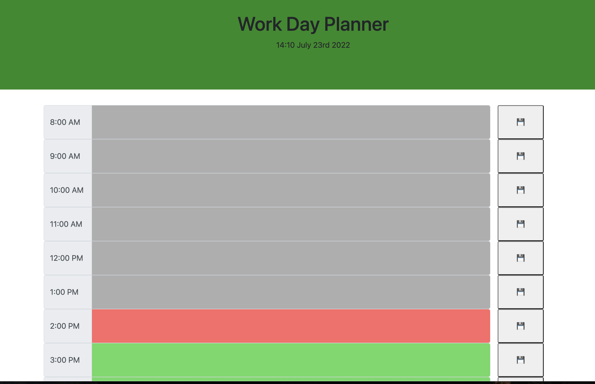
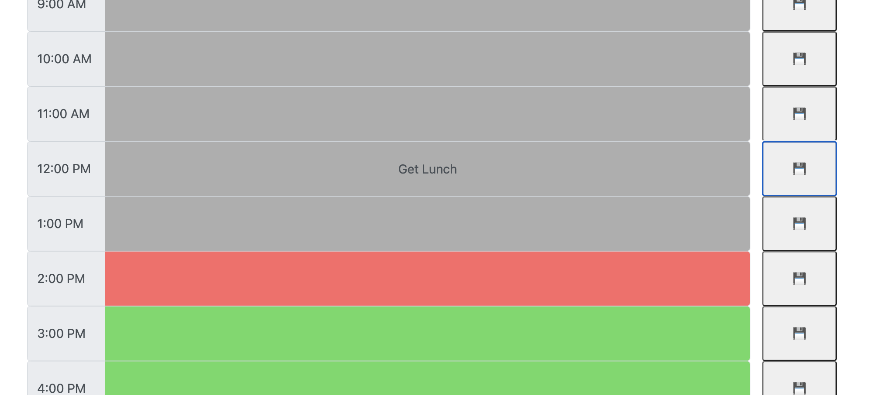
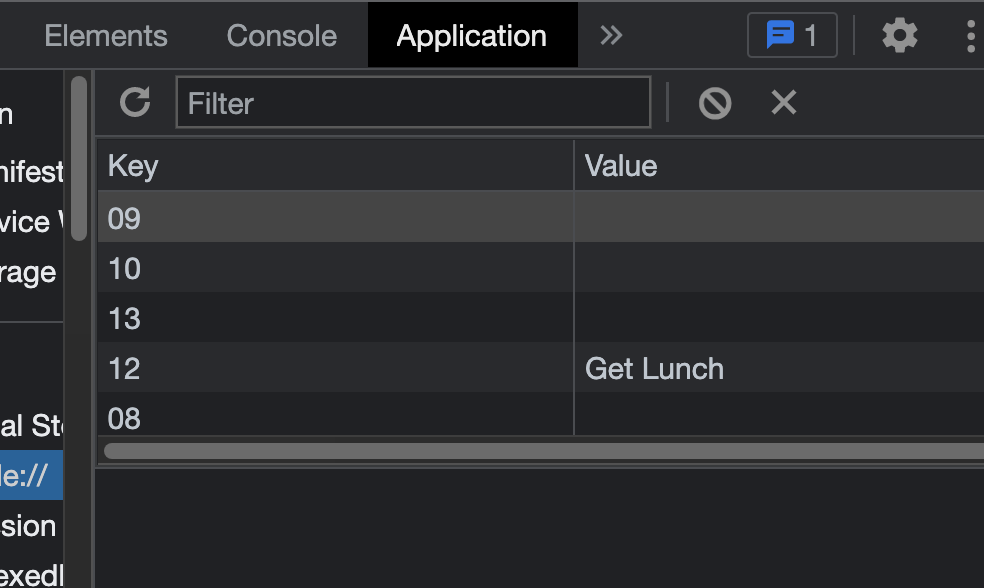

# Work-Day-Planner

Objective of this project is to create a work day planner in which rows will change color based on what time it is, when you click to add text there will be a save button to save it to local storage, and when you refresh the page it will load entries stored in local storage.

Technologies used:
1. Javascript
2. HTML
3. CSS
4. Bootstrap
5. Momentjs
6. Jquery

On page open the rows are blank but are colored. Red if it is on the current time, Green if it is in the future, and Gray if in the past.

You can then click on any of the rows and type a task to do for the chosen time slot. 

Once the save button is click it will store your entry into local storage.

On refresh the application will read local storage and prepopulate any time slot that has had an entry into it.